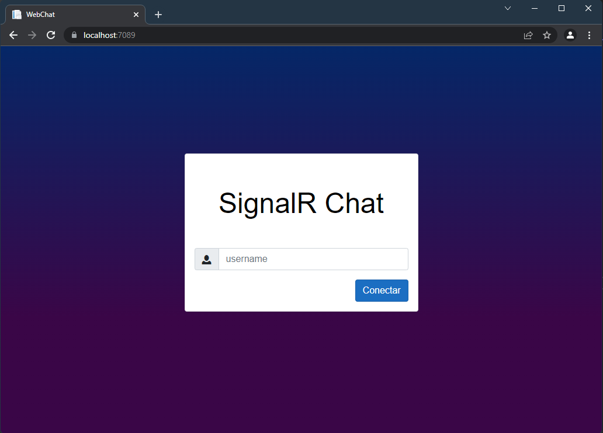
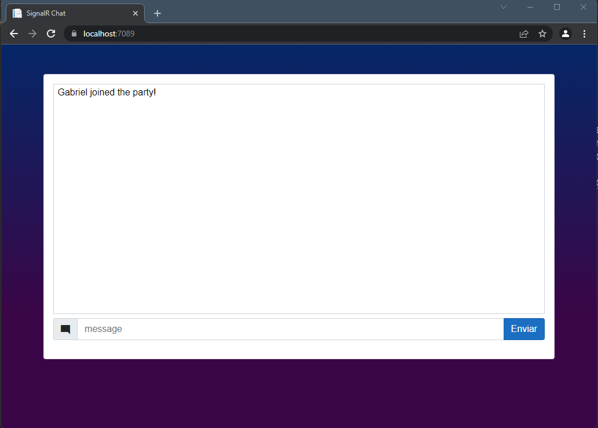

### WebChat

O projeto Web Chat surgiu da vontade de criar um chat para apenas aprender `WebSocket`, ele não foi criado para ter uma interface agradável para o usuario, nem para tem varios niveis de autenticação, mas sim apenas para estudo. 

Entretanto como é necessario a presença de um usuario para diferenciar quem manda a mensagem, um login sem necessidade de autenticação foi criado. Possui o campo de `Login`, que sera usado como usuario.

  

Na parte interior onde se encontra o chat, ha apenas um campo de texto e um botão para enviar a mensagem, e tambem a area para demonstração de todas as mensagens enviadas.

  

Hoje o chat não guarda registro nenhum de mensagem, isso poderia ser até uma feature para o futuro, mas esta em versão `v0.0.1` então ha muito oque incluir.

## Sobre o Projeto

No projeto foi utilizado as seguintes tecnologias:
 - [C#](https://docs.microsoft.com/pt-br/dotnet/csharp/), como principal linguagem de programação. versão 10.0
 - [DotNet Core](https://docs.microsoft.com/pt-br/dotnet/), como framework para o desenvolvimento do projeto. versão: 6.0
 - [Blazor Pages](https://docs.microsoft.com/pt-br/aspnet/core/blazor/?view=aspnetcore-6.0), como componente para criação de paginas Web
 - [SignalR](https://docs.microsoft.com/pt-br/aspnet/signalr/overview/getting-started/introduction-to-signalr), como componente para comunicação via websockets entre paginas. versã0: 6.0.2